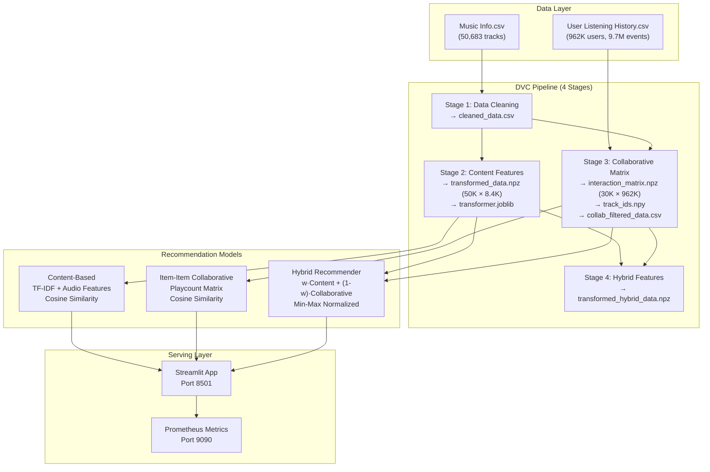

# Spotify Hybrid Recommender System

A weighted **Hybrid Music Recommender System** built on the [Million Song Dataset – Spotify Last.fm](https://www.kaggle.com/datasets/undefinenull/million-song-dataset-spotify-lastfm) (50,683 songs, 962,037 listeners, ~9.7M listening events), served through a Streamlit app, with the full pipeline versioned and reproducible via DVC.

## Architecture



## How it works

The app combines two recommenders with a tunable weight:

1. **Content-Based Filtering** — a `ColumnTransformer` featurizes every song
   (frequency-encoded `year`, one-hot `artist`/`key`/`time_signature`,
   TF-IDF `tags` with 85 features, standardized `duration_ms`/`loudness`/`tempo`,
   min-max scaled audio features) into an 8,431-dimensional vector, then ranks songs
   by cosine similarity.
2. **Item–Item Collaborative Filtering** — a sparse 30,459 × 962,037
   track–user playcount matrix (built with Dask) is ranked by cosine similarity
   between user-listening profiles.
3. **Hybrid** — both similarity score sets are min-max normalized per query and
   combined as `w·content + (1−w)·collaborative`. A "Diversity" slider in the UI
   controls `w` (higher diversity ⇒ less content weight).

Songs present in the listening history use the **hybrid** path; all other songs
fall back to **content-based** filtering.

## Project structure

```
├── app.py                      # Streamlit web app (entry point)
├── data_cleaning.py            # stage 1: clean Music Info.csv
├── content_based_filtering.py  # stage 2: feature transformer + content recs
├── collaborative_filtering.py  # stage 3: Dask interaction matrix + collab recs
├── transform_filtered_data.py  # stage 4: transform filtered data for hybrid
├── hybrid_recommendations.py   # HybridRecommenderSystem class
├── evaluate.py                 # Model evaluation (Precision@K, Recall@K, NDCG@K, MAP@K)
├── dvc.yaml                    # 4-stage pipeline definition
├── docker-compose.yml          # Container orchestration
├── Dockerfile                  # Multi-stage build
├── prometheus.yml              # Prometheus config
├── grafana/                    # Grafana dashboards & datasources
├── notebooks/                  # exploratory EDA / content / collaborative notebooks
├── data/                       # raw CSVs (DVC-tracked) + generated artifacts
└── test_app.py                 # smoke test for the running app
```

## Pipeline (DVC)

```bash
dvc repro   # runs: data_cleaning → transform_data → interaction_data → transformed_filtered_data
```

Generated artifacts (in `data/` unless noted):

| Artifact | Used for |
|---|---|
| `cleaned_data.csv` | song catalog (50,683 rows) |
| `transformed_data.npz` | content-based similarity (50,683 × 8,431) |
| `transformer.joblib` | fitted feature transformer |
| `collab_filtered_data.csv` | songs with listening history (30,459) |
| `track_ids.npy` | row ↔ track_id mapping for the matrix |
| `interaction_matrix.npz` | collaborative matrix (30,459 × 962,037) |
| `transformed_hybrid_data.npz` | content vectors for the hybrid path |

## Evaluation

```bash
python evaluate.py --sample 100   # runs Precision@K, Recall@K, NDCG@K, MAP@K on sampled users
```

Results saved to `evaluation_results.json`. Full evaluation on 962K users requires distributed compute (Spark/Dask/GPU).

## Run locally

```bash
python -m venv .venv
.venv\Scripts\activate            # Windows  (source .venv/bin/activate on Linux)
pip install -r requirements.txt

# data: download the Kaggle dataset and place both CSVs into data/
# Music Info.csv  +  User Listening History.csv

dvc repro                         # generate artifacts
streamlit run app.py              # http://localhost:8501
```

### With Docker

```bash
docker-compose up --build         # app on :8501, metrics on :9090, Grafana on :3000
```

## Monitoring

- **Prometheus metrics**: `http://localhost:9090/metrics`
  - `recsys_requests_total` — request count by model_type & status
  - `recsys_request_latency_seconds` — latency histogram
  - `recsys_active_users` — concurrent users
  - `recsys_recommendations_total` — recommendations served

- **Grafana**: `http://localhost:3000` (admin/admin)

## CI/CD

GitHub Actions workflow (`.github/workflows/ci.yml`) runs on push/PR:
- Lint (ruff) + Type check (mypy)
- Unit tests (pytest + coverage)
- DVC pipeline validation (dry-run)
- Streamlit smoke test
- Docker build & test

## Tech Stack

| Layer | Tools |
|---|---|
| Data | pandas, Dask, PyArrow |
| ML | scikit-learn, category_encoders, joblib |
| Pipeline | DVC |
| Serving | Streamlit |
| Monitoring | Prometheus, Grafana |
| Container | Docker, Docker Compose |
| CI/CD | GitHub Actions |
| Quality | ruff, mypy, pytest, pre-commit |

## Model Card

See [MODEL_CARD.md](MODEL_CARD.md) for detailed model documentation including intended use, limitations, biases, and ethical considerations.

## License

MIT License — see [LICENSE](LICENSE) for details.

Type a song name and pick the exact match from the fuzzy-search suggestions
(song titles/artists are matched exactly as stored, e.g. *beyoncé*).